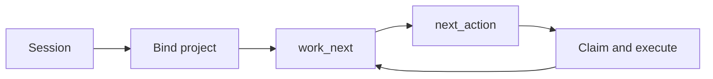

# AgentStack

[](https://agentstack.tech)
[](https://agentstack.tech/mcp/actions)
[](https://agentstack.tech/work-graph)

> After one bind, the agent does not shop the catalog. **Work Graph** hands it the next step. Live edits stay on the **safe circle**: write a copy, pass the checks, then publish.

One MCP tool, `agentstack.execute`. The server holds the plan. Each turn is one action. Idle is a valid answer. Blocked names the unblock.

**Story:** [agentstack.tech/work-graph](https://agentstack.tech/work-graph) · **Contract:** [docs/plugins/WORK_GRAPH.md](docs/plugins/WORK_GRAPH.md) · **Safe circle:** [agentstack.tech/mcp-docs#safe-cycle](https://agentstack.tech/mcp-docs#safe-cycle)

---

## The loop

```text
session → context.project_id → agents.work_next → packet.next_action → claim / execute → work_next
```

Recipe `mcp_work_loop_v1`. Prompt [`agentstack_closed_loop_autonomy`](https://agentstack.tech/mcp/prompts/get?name=agentstack_closed_loop_autonomy).



When that step changes live data, the same project runs the safe circle:

```text
connect → sandbox → review → promote
```

The agent writes a generation. Customers stay on the previous copy until the checks pass. The project’s own rule publishes it: at once, or in stages.

| Who | Without the loop | With Work Graph |
|-----|------------------|-----------------|
| Founder with open loops | Every new chat re-reads the tool menu | The outcome is written once. The next chat takes the head of the queue |
| A person with more tasks than hours | The agent invents a tool and spends the window choosing | The list says ready, blocked, or idle |
| A business that needs the work finished | Thrash between catalog, guess, and retry | Claim, execute, verify, on the same project as the site and the payments |
| Someone wiring an agent | Paste the catalog into the prompt | `agents.work_next`, then `packet.next_action` |

## Measured on 2026-10-07

Local registry build. Not a production traffic sample. Not a provider tokenizer. Bytes ÷ 4 is an English size estimate.

| Payload | UTF-8 bytes | Rough tokens |
|---------|-------------|--------------|
| Example `next_action` plus two alternatives | 250 | ~63 |
| `discovery.search`, first 20 compact rows | 8,889 | ~2,222 |
| Handshake contract JSON, once | 11,297 | ~2,824 |
| Compact search, 50 rows (HTTP max) | 20,852 | ~5,213 |
| Full registry catalog JSON (795 actions in that build) | 1,680,071 | ~420,018 |

The full catalog is **6,720×** that example packet. A 20-row search page is **35.6×** it. The public catalog you should quote is **714** actions — live `GET /mcp/actions/summary`. Do not add the byte ratio and the operator targets into one savings claim.

| Signal | Target |
|--------|--------|
| Autonomous loops that follow `packet.next_action` | ≥ 90% |
| Catalog shopping while a packet is already present | ≤ 5% |

Those are steady-production goals, not a live counter. Method and scenarios: [docs/plugins/WORK_GRAPH.md](docs/plugins/WORK_GRAPH.md).

---

## Docs

This repository is the **public** documentation (English, user- and integrator-facing): web product, MCP, plugins, REST, RAG, sandboxes, and examples.

**If you use the website:** [docs/USER_FEATURES_GUIDE.md](docs/USER_FEATURES_GUIDE.md).

**If you build a product:** [docs/BUILD_YOUR_PRODUCT.md](docs/BUILD_YOUR_PRODUCT.md) — `@agentstack/sdk`, optional [genetic-ai-starter](https://github.com/agentstacktech/genetic-ai-starter).

**If you run agents on a large codebase:** [docs/genetic-system/](docs/genetic-system/).

**If you integrate:** [docs/MCP_AND_ECOSYSTEM.md](docs/MCP_AND_ECOSYSTEM.md) — start with the loop, then the catalog (**714** actions · [docs/MCP_SCALE.md](docs/MCP_SCALE.md)).

**REST / OpenAPI:** [docs/OPENAPI.md](docs/OPENAPI.md) — [Swagger](https://agentstack.tech/swagger) · [openapi.json](https://agentstack.tech/openapi.json).

**npm SDK:** [@agentstack/sdk](https://www.npmjs.com/package/@agentstack/sdk) · [docs/sdk/](docs/sdk/)

**Full index:** [docs/README.md](docs/README.md) · **What's new:** [docs/WHATS_NEW.md](docs/WHATS_NEW.md)

---

## Open source kit

| Repo | Branch | Notes |
|------|--------|--------|
| [genetic-ai-starter](https://github.com/agentstacktech/genetic-ai-starter) | `main` | Map-first install: `npx @agentstack/genetic-ai-starter init`. SoT lives in this repo under `genetic-ai-starter/` when you have the monorepo. |

## Plugins

| Plugin | Notes |
|--------|--------|
| [cursor-plugin](https://github.com/agentstacktech/cursor-plugin) | **v0.4.18, gen3** — rules, skills, commands, agents, hooks; Plugin MCP Connect and **OAuth 2.1 device code** |
| [claude-plugin](https://github.com/agentstacktech/claude-plugin) | Claude Desktop / API installers |
| [gpt-plugin](https://github.com/agentstacktech/gpt-plugin) | ChatGPT / OpenAI ecosystem |
| [vscode-plugin](https://github.com/agentstacktech/vscode-plugin) | VS Code marketplace distribution |

## Product

- **Site:** [agentstack.tech](https://agentstack.tech)
- **Work Graph:** [agentstack.tech/work-graph](https://agentstack.tech/work-graph)
- **GitHub org:** [github.com/agentstacktech](https://github.com/agentstacktech)
