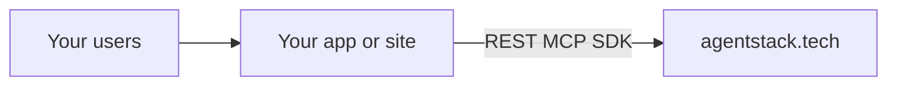

# Build your product on AgentStack

Ship a **client, app, or site** with backend on [agentstack.tech](https://agentstack.tech) — use the hosted dashboard, **`@agentstack/sdk`**, and/or **MCP** (`agentstack.execute`).

## Prerequisites

- Account at [agentstack.tech](https://agentstack.tech)
- A **project** (dashboard or API)
- **API key** or OAuth token — [auth/README.md](auth/README.md)
- Node 18+ for TypeScript: `npm install @agentstack/sdk`

## Choose your plane

| Plane | Best for | Entry |
|-------|----------|--------|
| **Dashboard only** | Operators, no custom code | [USER_FEATURES_GUIDE.md](USER_FEATURES_GUIDE.md) |
| **SDK app** | React, Next, mobile, game client | This doc + [sdk/RECIPES.md](sdk/RECIPES.md) |
| **MCP agent** | Cursor, Claude, automation | [MCP_QUICKSTART.md](MCP_QUICKSTART.md) |
| **Hybrid** | Custom UI + agent tooling | SDK + [plugins/CONTEXT_FOR_AI_MCP.md](plugins/CONTEXT_FOR_AI_MCP.md) |

## Architecture



## Golden paths (tutorials)

| # | Scenario | Tutorial |
|---|----------|----------|
| 1 | Static / SPA hosting | [tutorials/01_hosting_static_site.md](tutorials/01_hosting_static_site.md) |
| 2 | SaaS data (8DNA) | [tutorials/02_saas_dna_crud.md](tutorials/02_saas_dna_crud.md) |
| 3 | Chat app | [tutorials/03_messenger_app.md](tutorials/03_messenger_app.md) |
| 4 | AI + RAG + agent | [tutorials/04_ai_rag_agent.md](tutorials/04_ai_rag_agent.md) |
| 5 | Support desk | [tutorials/05_support_channel.md](tutorials/05_support_channel.md) |
| 6 | Integrations / Zapier-class | [tutorials/06_integrations_recipes.md](tutorials/06_integrations_recipes.md) |
| 7 | Shop / buffs | [tutorials/07_commerce_shop.md](tutorials/07_commerce_shop.md) |
| 8 | Autonomous agent loop | [tutorials/08_robot_mcp_loop.md](tutorials/08_robot_mcp_loop.md) |

## Bootstrap (SDK)

```typescript
import { AgentStackSDK, resolveAgentStackApiBase } from '@agentstack/sdk';

export const sdk = new AgentStackSDK({
  apiBase: resolveAgentStackApiBase(),
});

await sdk.platform.auth.login({
  email: process.env.AGENTSTACK_EMAIL!,
  password: process.env.AGENTSTACK_PASSWORD!,
});
```

Prefer **`sdk.protocol`** for DNA commands and snapshot cache — [sdk/AGENT_PROTOCOL_QUICKSTART.md](sdk/AGENT_PROTOCOL_QUICKSTART.md).

## AI teams: genetic navigation

The **Genetic System** (Navigation OS) gives agents stable addresses — genetic tags, a central map, local indexes — so they land in canonical files instead of repo-wide grep. Primary ROI is **labor calendar** (fewer wrong-tree edits); token savings follow when map → index prefixes stabilize.

| Doc | Purpose |
|-----|---------|
| [genetic-system/GENETIC_SYSTEM_OVERVIEW.md](genetic-system/GENETIC_SYSTEM_OVERVIEW.md) | What it is, five-step workflow, agents-in-2026 context |
| [genetic-system/AI_MODEL_ECONOMICS.md](genetic-system/AI_MODEL_ECONOMICS.md) | Harness numbers, SDK leverage, honest caveats |
| [genetic-ai-starter](https://github.com/agentstacktech/genetic-ai-starter) | Portable kit for **your** repo |

For map-first Cursor rules and starter genes in **your** repo (not copied from this mirror):

```bash
npx @agentstack/genetic-ai-starter init --profile standard --project-name "My SaaS" --domain app
```

AgentStack consumers: use profile **`agentstack-app`** — [AGENTSTACK_APP_GUIDE](https://github.com/agentstacktech/genetic-ai-starter/blob/main/meta/docs/AGENTSTACK_APP_GUIDE.md).

Interactive explainer (monorepo, RU/EN/PT): [docs/genetic-system-site](https://github.com/agentstacktech/AgentStack/tree/master/docs/genetic-system-site).

## Honest limits

- Subscription gates: [subscription/SUBSCRIPTION_TIERS.md](subscription/SUBSCRIPTION_TIERS.md)
- Rate limits: [operations-public/RATE_LIMITS_AND_ERRORS.md](operations-public/RATE_LIMITS_AND_ERRORS.md)
- Hosting bytes count toward project storage quota — [hosting/HOSTING_QUICKSTART.md](hosting/HOSTING_QUICKSTART.md)

**Next:** [JOURNEY_MAP.md](JOURNEY_MAP.md) · [PARITY_MATRIX.md](PARITY_MATRIX.md) · [WHATS_NEW.md](WHATS_NEW.md)
