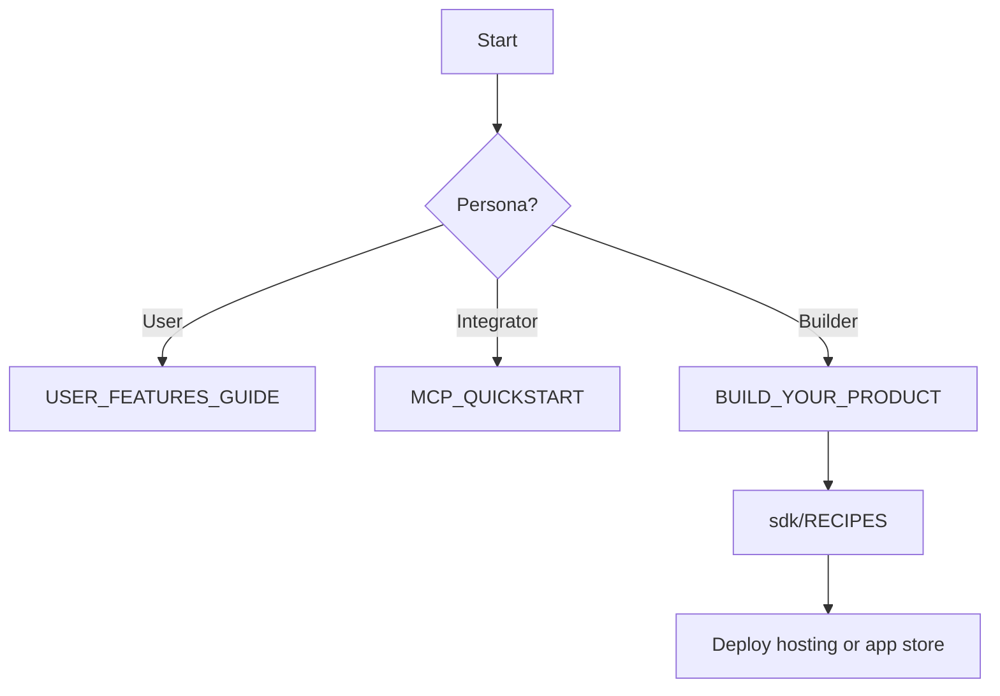

# Journey map

| Persona | Goal | Steps |
|---------|------|-------|
| **Dashboard user** | Use RAG, sandbox, RBAC | Sign in → project → [USER_FEATURES_GUIDE.md](USER_FEATURES_GUIDE.md) |
| **MCP automator** | Batch platform actions | API key → [MCP_QUICKSTART.md](MCP_QUICKSTART.md) → `GET /mcp/actions` |
| **Product builder** | Own UI + AgentStack backend | [BUILD_YOUR_PRODUCT.md](BUILD_YOUR_PRODUCT.md) → [sdk/RECIPES.md](sdk/RECIPES.md) |
| **Mobile dev** | App + push | [sdk/MOBILE_AND_PWA.md](sdk/MOBILE_AND_PWA.md) |
| **AI agent team** | Repo + genes + MCP | genetic-ai-starter → [plugins/CONTEXT_FOR_AI.md](plugins/CONTEXT_FOR_AI.md) |

