# API channels and execution protocols

**Audience:** Developers and AI agents integrating with AgentStack on [agentstack.tech](https://agentstack.tech).

## Two product layers

1. **Universal access (preferred for new integrations)** — MCP batch execution (`POST /mcp`, `agentstack.execute`), 8DNA key-value data, and Protein/Logic command surfaces. Capability grows via **action lists**, **command handlers**, and **JSON keys**, not primarily via new OpenAPI paths.
2. **REST compatibility** — Many specific `/api/*` and `/auth/*` routes for browsers, existing SDKs, webhooks, OAuth, and uploads.

**Live OpenAPI:** [openapi.json](https://agentstack.tech/openapi.json) · [Swagger UI](https://agentstack.tech/swagger) · [OPENAPI.md](../OPENAPI.md)

## System map

```mermaid
flowchart TB
  subgraph clients [Clients]
    AI[AI agents and plugins]
    SPA[Web and mobile apps]
    SDK[TypeScript SDK]
  end
  subgraph universal [Universal access]
    MCP[POST /mcp]
    DNA[8DNA KV /api/dna/data]
    CMD[Protein commands /api/commands]
  end
  subgraph rest [REST compatibility]
    API[/api domain routes/]
  end
  clients --> MCP
  clients --> DNA
  clients --> CMD
  clients --> API
  MCP --> API
```

## Messenger channels (integrator contract)

| Channel style | Typical history read | Send message |
|---------------|---------------------|--------------|
| **Distributed public channel** | `GET /api/social/channel/{channel_id}/history` | `POST /api/social/channel/{channel_id}/message` |
| **Legacy chat contour** | `GET /api/social/chat/history` | `POST /api/social/chat/message` |

Create shared rooms with `POST /api/social/channel` (UUID channel id). Use the messenger integration guides for offline sync and push — [../messenger/README.md](../messenger/README.md).

## Choosing a channel

| Need | Start here |
|------|------------|
| AI automation | [MCP_QUICKSTART.md](../MCP_QUICKSTART.md) |
| Typed app | [sdk/README.md](../sdk/README.md) · [sdk/AGENT_PROTOCOL_QUICKSTART.md](../sdk/AGENT_PROTOCOL_QUICKSTART.md) |
| Raw REST | [OPENAPI.md](../OPENAPI.md) |
| Data keys | [DNA_KEY_VALUE_API.md](DNA_KEY_VALUE_API.md) |

**Parity across channels:** [PARITY_MATRIX.md](../PARITY_MATRIX.md)
