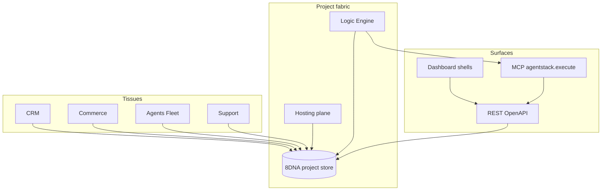

# Fabric: one platform

AgentStack is a **single fabric** — shared data, shared automation, shared surfaces — not a basket of unrelated APIs. Three metaphors help integrators reason about it.

---

## Three metaphors

### 1. Shared notebook (8DNA)

Every project is one **notebook** of typed pages: contacts, deals, assets, logic rules, hosted files. CRM, commerce, and agents **write on the same pages** with different pens (REST, MCP, UI).

**Benefit:** One `project_id`, one permission model, one export story.

### 2. Nervous system (signals + logic)

**Logic** listens for signals (webhooks, schedules, messenger events) and fires **processors** and **MCP actions**. The scheduler is the slow heartbeat; webhooks are the fast reflexes.

**Benefit:** Automate cross-tissue flows without maintaining glue infrastructure.

### 3. Universal remote (MCP + Compass)

**MCP** is the integrator remote: <!-- stats:total_actions -->463<!-- /stats:total_actions --> catalog actions, one `agentstack.execute` transport. **Compass** is the human remote: same capabilities as playbooks and comfort tasks.

**Benefit:** Agents and operators stay aligned on action names and routes.

---

## Leak boundary (public docs)

Document for integrators:

- MCP action names (`crm.*`, `hosting.*`, `agentnet.*`)
- REST paths (`/api/projects/...`, `/api/agentnet/...`)
- SDK entry points (`sdk.protocol`, `@agentstack/sdk/commerce/assets`)

Do **not** depend on internal module paths, rollout flags, or operator-only admin routes in your integrations.

---

## Architecture diagram

---

## Eight cross-system flows

Honest status: **Solid** = production integrator path today. **Partial** = schema or read path exists; write bridge incomplete. **Planned** = roadmap.

| # | Flow | Steps | Status |
|---|------|-------|--------|
| 1 | **Lead → deal → host** | `crm.upsert_contact` → `crm.create_deal` → `hosting.site.quick_start` | **Solid** |
| 2 | **Storefront sell** | `assets.create` → `commerce.storefront.seed_apply` → `commerce.storefront.hosted_publish` | **Solid** |
| 3 | **Webhook → logic → CRM** | `integrations.test_hook` → `logic.execute` → `crm.log_activity` | **Solid** (recipe install helps) |
| 4 | **Support + RAG** | `social.support.inbox` → `rag.search` → `social.support.send` | **Partial** — AI binding per project config |
| 5 | **Agent run → proof** | `agents.run` → `agentnet.solana.proof_bundle_for_run` → public bundle URL | **Solid** on demo/devnet rails |
| 6 | **CRM ↔ commerce order** | Deal `linked_order_id` from checkout | **Partial** — field read-only until bridge |
| 7 | **Offline chat → push** | Messenger delta sync → `notifications.send_push` | **Partial** — requires PWA subscribe |
| 8 | **Sandbox → production** | `generation.promote` or `hosting.release.promote` | **Solid** for hosting releases; generation promote for 8DNA sandboxes |

Caveats per flow: see [explanation/synergies/SYNERGY_COOKBOOK.md](synergies/SYNERGY_COOKBOOK.md).

---

## Where to go next

| Goal | Doc |
|------|-----|
| CRM tissue | [crm/README.md](../crm/README.md) |
| Economy | [economy/AGENTNET_INTEGRATOR_GUIDE.md](../economy/AGENTNET_INTEGRATOR_GUIDE.md) |
| Hosting | [hosting/HOSTING_GOLDEN_PATHS.md](../hosting/HOSTING_GOLDEN_PATHS.md) |
| Synergy recipes | [synergies/SYNERGY_COOKBOOK.md](synergies/SYNERGY_COOKBOOK.md) |
| MCP catalog | [MCP_CAPABILITY_MATRIX.md](../MCP_CAPABILITY_MATRIX.md) |
