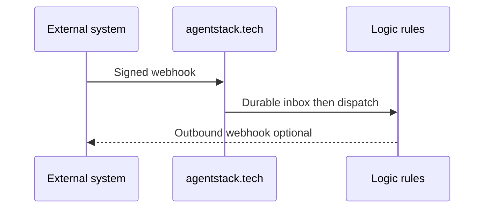

# Integration Hub

Connect Stripe, GitHub, Telegram, and other systems via **recipes**, **inbound webhooks**, and **outbound signed deliveries** — on Logic Engine + 8DNA, not a separate Zapier clone.

## Flow

**MCP:** `integrations.*` — [MCP_CAPABILITY_MATRIX.md](../MCP_CAPABILITY_MATRIX.md)

**Next:** [INTEGRATION_QUICKSTART.md](INTEGRATION_QUICKSTART.md) · [../security/WEBHOOK_SECURITY.md](../security/WEBHOOK_SECURITY.md)
