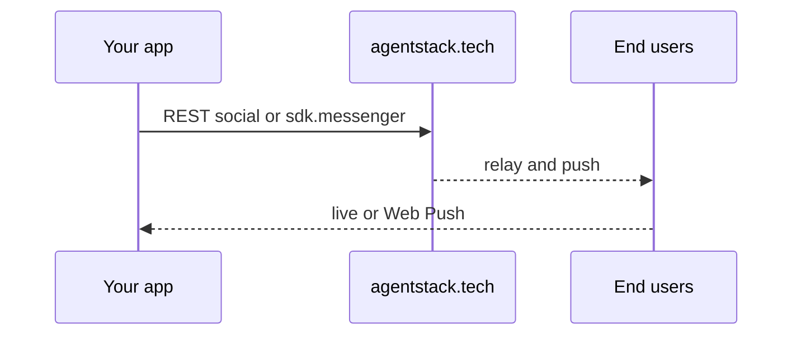

# Messenger — integrate chat & social actions

AgentStack exposes **real-time messaging** and **social** primitives through the same MCP catalog as the web app: call named actions via `POST /mcp` / `agentstack.execute`, or use the **`sdk.messenger`** façade in `@agentstack/sdk`.

## Contents

| Doc | Purpose |
|-----|---------|
| [INTEGRATION_QUICKSTART.md](INTEGRATION_QUICKSTART.md) | Minimal TypeScript example (`sdk.messenger`) |
| [SOCIAL_API_REFERENCE.md](SOCIAL_API_REFERENCE.md) | **`social.*`** and **`social.chat.*`** MCP actions (summary) |
| [OFFLINE_AND_RELIABILITY.md](OFFLINE_AND_RELIABILITY.md) | What “local-first” means for integrators (behavior, not internals) |

## Discover actions

- **`GET https://agentstack.tech/mcp/actions`** — full catalog (requires auth as for your integration).
- Snapshot tables: [MCP_CAPABILITY_MATRIX.md](../MCP_CAPABILITY_MATRIX.md) (mirrors the live catalog for offline reading).

## Flow (integrator view)

## Ordering

Use the **server timeline key** returned with messages — do not assume per-device sequence numbers are global. Details: [OFFLINE_AND_RELIABILITY.md](OFFLINE_AND_RELIABILITY.md).

## Related

- [support/](../support/) — project support threads share messenger transports.
- [MCP_AND_ECOSYSTEM.md](../MCP_AND_ECOSYSTEM.md) — ecosystem index.
