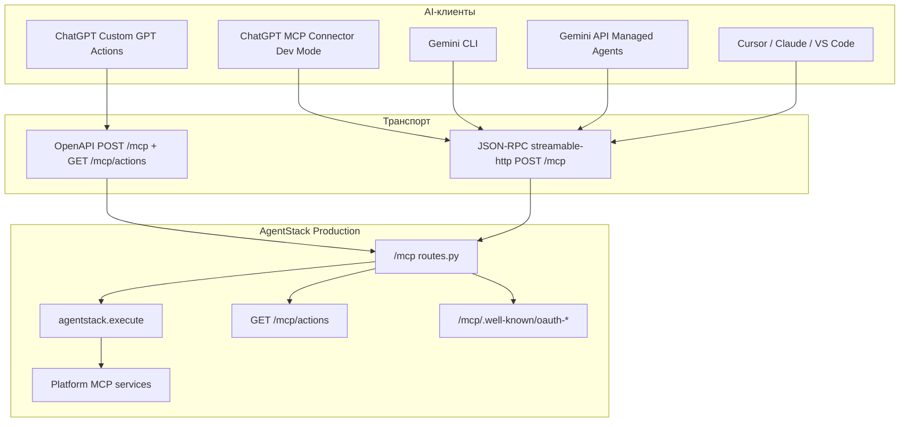

# AgentStack MCP в ChatGPT и Gemini — карта и инструкция

**Genetic tag:** `docs.plugins.chatgpt_gemini_mcp.gen1`  
**Аудитория:** Lance, интеграторы, AI-агенты  
**Дата:** 2026-08-20  
**SoT для действий:** `GET https://agentstack.tech/mcp/actions` · [MCP_CAPABILITY_MATRIX.md](../MCP_CAPABILITY_MATRIX.md)

> **Нужно просто подключить в браузере и писать команды?** → [MCP_CHAT_COMMAND_COOKBOOK.md](MCP_CHAT_COMMAND_COOKBOOK.md) (короткая инструкция + примеры фраз для чата).

---

## Содержание

1. [Краткий вывод](#краткий-вывод)
2. [Архитектурная карта](#архитектурная-карта)
3. [Единый контракт AgentStack MCP](#единый-контракт-agentstack-mcp)
4. [ChatGPT — три пути интеграции](#chatgpt--три-пути-интеграции)
5. [Gemini — два пути интеграции](#gemini--два-пути-интеграции)
6. [Матрица аутентификации](#матрица-аутентификации)
7. [Матрица клиентов и возможностей](#матрица-клиентов-и-возможностей)
8. [Рекомендации по улучшению](#рекомендации-по-улучшению)
9. [Диагностика и troubleshooting](#диагностика-и-troubleshooting)
10. [Ссылки](#ссылки)

---

## Краткий вывод

| Клиент | Рекомендуемый путь | Артефакт в репо |
|--------|-------------------|-----------------|
| **ChatGPT (быстрый старт)** | Custom GPT + GPT Actions (OpenAPI) | [gpt-plugin/GPT_QUICKSTART.md](https://github.com/agentstacktech/gpt-plugin/blob/main/GPT_QUICKSTART.md) |
| **ChatGPT (нативный MCP)** | Developer Mode → MCP Connector | этот документ §4.2 |
| **Gemini (CLI / Spark / Managed Agents)** | Gemini CLI + Spark Connected Apps | [gemini-plugin/GEMINI_CLI_QUICKSTART.md](https://github.com/agentstacktech/gemini-plugin/blob/main/GEMINI_CLI_QUICKSTART.md) · [GEMINI_SPARK_QUICKSTART.md](https://github.com/agentstacktech/gemini-plugin/blob/main/GEMINI_SPARK_QUICKSTART.md) |
| **Gemini (API / Managed Agents)** | `mcp_server` tool в Interactions API | этот документ §5.2 |

**Один backend, один endpoint:** `https://agentstack.tech/mcp`  
**Один инструмент в `tools/list`:** `agentstack.execute`  
**Полный каталог действий:** `GET /mcp/actions` (<!-- stats:total_actions -->568<!-- /stats:total_actions --> actions, <!-- stats:mcp_domains -->48<!-- /stats:mcp_domains --> domains)

Продакшн-проверка ChatGPT scanner (2026-08-20): все шаги `initialize` → `tools/list` → `notifications/initialized` → `.well-known` возвращают **200 OK**. Live probe: `node provided_plugins/cursor-plugin/scripts/verify-mcp-surface-e2e.mjs`.

---

## Архитектурная карта



### Плоскости данных

| Плоскость | Что видит клиент | Где SoT |
|-----------|------------------|---------|
| **Transport** | `tools/list` → 1 tool | `POST /mcp` handler `_tools_list_result()` |
| **Catalog** | <!-- stats:total_actions -->568<!-- /stats:total_actions --> action names | `GET /mcp/actions`, `MCP_CAPABILITY_MATRIX.md` |
| **Routing** | «когда X → domain Y» | [CONTEXT_FOR_AI.md](CONTEXT_FOR_AI.md) |
| **Auth** | API key / OAuth / Bearer | [AUTHENTICATION.md](../architecture/AUTHENTICATION.md) |

---

## Единый контракт AgentStack MCP

### Endpoint

```
https://agentstack.tech/mcp
```

Не добавляйте `/tools`, `/sse` или другие суффиксы — только `/mcp`.

### Вызов действия

**Через JSON-RPC (Cursor, Claude, Gemini CLI, ChatGPT MCP Connector):**

```json
{
  "jsonrpc": "2.0",
  "method": "tools/call",
  "params": {
    "name": "agentstack.execute",
    "arguments": {
      "steps": [
        { "action": "projects.get_projects", "params": {} }
      ]
    }
  },
  "id": 1
}
```

**Через GPT Actions (OpenAPI):**

```json
{
  "tool": "projects.get_projects",
  "params": {}
}
```

POST на `/mcp` с телом `{tool, params}` — упрощённый контракт для Custom GPT.

### Discovery до вызова

1. `GET /mcp/actions` — полный каталог (имя, категория, caps)
2. [MCP_CAPABILITY_MATRIX.md](../MCP_CAPABILITY_MATRIX.md) — стабильная ссылка для инструкций
3. [CONTEXT_FOR_AI.md](CONTEXT_FOR_AI.md) — маршрутизация по доменам

### Получение API-ключа (без регистрации)

```bash
curl -X POST https://agentstack.tech/mcp/tools/projects.create_project_anonymous \
  -H "Content-Type: application/json" \
  -d '{"params": {"name": "My AI Project"}}'
```

Из ответа сохраните `user_api_key` или `project_api_key`.

---

## ChatGPT — три пути интеграции

### 4.1 Custom GPT + GPT Actions (рекомендуется для MVP)

**Когда использовать:** быстрый старт, шаринг GPT с командой, не нужен Developer Mode / Business plan.

**Артефакты:** [gpt-plugin repo](https://github.com/agentstacktech/gpt-plugin)

| Шаг | Действие |
|-----|----------|
| 1 | Получить API key (anonymous project или аккаунт) |
| 2 | ChatGPT → Explore → Create a GPT |
| 3 | Actions → вставить `openapi/agentstack-mcp.yaml` |
| 4 | Authentication → API Key, header `X-API-Key` |
| 5 | Instructions → скопировать [GPT_INSTRUCTIONS.md](https://github.com/agentstacktech/gpt-plugin/blob/main/GPT_INSTRUCTIONS.md) |
| 6 | Тест: «List my projects», «Create project Test» |

**Плюсы:** работает на любом ChatGPT Plus; OpenAPI с `list_actions` + `execute_tool`; инструкции уже готовы.  
**Минусы:** не нативный MCP protocol; модель видит 2 REST-операции, а не JSON-RPC tool.

Подробно: [GPT_QUICKSTART.md](https://github.com/agentstacktech/gpt-plugin/blob/main/GPT_QUICKSTART.md)

---

### 4.2 ChatGPT MCP Connector (Developer Mode)

**Когда использовать:** нужен нативный MCP в чате ChatGPT; Business/Enterprise workspace; deep research / company knowledge.

**Требования OpenAI (2026):**
- Developer Mode в Settings → Security and login (или Workspace admin)
- Публичный HTTPS endpoint (AgentStack prod уже подходит)
- OAuth PKCE или API key в заголовках

**Настройка:**

1. **Включить Developer Mode**  
   Settings → Security and login → Developer mode ON  
   (Business/Edu: Workspace Settings → Permissions → Connected Data Developer mode)

2. **Создать developer-mode app**  
   Settings → Plugins (или chatgpt.com/plugins) → Create

3. **Заполнить метаданные:**
   - **Name:** AgentStack
   - **Description:** Backend-as-a-service: projects, 8DNA data, rules, payments, agents, hosting
   - **MCP server URL:** `https://agentstack.tech/mcp`

4. **Аутентификация** — выберите один из вариантов:

   | Режим | Конфигурация |
   |-------|--------------|
   | **API Key** | Header `X-API-Key: <your_key>` |
   | **OAuth (MCP well-known)** | Authorization: `https://agentstack.tech/mcp/.well-known/oauth-authorize` · Token: `https://agentstack.tech/mcp/.well-known/oauth-token` |
   | **OAuth (ecosystem)** | Authorization: `https://agentstack.tech/api/oauth2/authorize` · Token: `https://agentstack.tech/api/oauth2/token` |

5. **Проверка:** после Create должен появиться список tools — ожидайте **1 tool**: `agentstack.execute`

6. **В чате:** + → More → выберите AgentStack → «List my AgentStack projects»

**OAuth redirect для Custom GPT / ChatGPT plugins:**
```
https://chat.openai.com/aip/g-*/oauth/callback
```
Поддерживается wildcard в ecosystem OAuth clients (см. [AUTHENTICATION.md](../architecture/AUTHENTICATION.md)).

**Private MCP (on-prem):** OpenAI Secure MCP Tunnel — `tunnel-client` + Platform tunnel settings. Для self-hosted AgentStack без публичного URL.

Документация OpenAI:
- [Connect from ChatGPT](https://developers.openai.com/apps-sdk/deploy/connect-chatgpt)
- [Building MCP servers](https://developers.openai.com/api/docs/mcp)
- [Developer mode & MCP connectors](https://help.openai.com/en/articles/12584461)

---

### 4.3 OpenAI API (Responses + remote MCP)

**Когда использовать:** свой продукт на OpenAI API, не ChatGPT UI.

```json
{
  "tools": [{
    "type": "mcp",
    "server_url": "https://agentstack.tech/mcp",
    "headers": { "X-API-Key": "<key>" }
  }]
}
```

Или OAuth `authorization` с access token. См. [MCP and Connectors](https://developers.openai.com/api/docs/guides/tools-connectors-mcp).

---

## Gemini — два пути интеграции

> **Важно:** у Google **нет** consumer-аналога Custom GPT с marketplace-плагином AgentStack. Интеграция — через **Gemini CLI** (терминал) или **Gemini API Managed Agents** (программно).

### 5.1 Gemini CLI (рекомендуется для разработчиков)

**Когда использовать:** терминальный AI-агент, локальная разработка, OAuth к remote MCP.

**Quick Start:** [gemini-plugin/GEMINI_CLI_QUICKSTART.md](https://github.com/agentstacktech/gemini-plugin/blob/main/GEMINI_CLI_QUICKSTART.md)

```bash
# Streamable HTTP (рекомендуется — тот же transport, что Cursor)
gemini mcp add agentstack --scope user --transport http https://agentstack.tech/mcp \
  --header "X-API-Key: <YOUR_API_KEY>" \
  --header "Content-Type: application/json"

# Проверка
gemini mcp list
# в сессии Gemini CLI:
/mcp list
```

**OAuth (если сервер требует):**
```bash
/mcp auth agentstack
```

Gemini CLI поддерживает stdio, SSE и Streamable HTTP. AgentStack — **Streamable HTTP** на `https://agentstack.tech/mcp`.

Документация Google: [gemini-cli MCP server guide](https://github.com/google-gemini/gemini-cli/blob/main/docs/tools/mcp-server.md)

---

### 5.2 Gemini API — Managed Agents + remote MCP

**Когда использовать:** production-агенты в облаке Google, фоновые задачи, sandbox + внешние tools.

```typescript
import { GoogleGenAI } from "@google/genai";

const client = new GoogleGenAI({});

const interaction = await client.interactions.create({
  agent: "antigravity-preview-05-2026",
  input: "List my AgentStack projects and summarize stats for the first one.",
  environment: "remote",
  tools: [
    { type: "google_search" },
    {
      type: "mcp_server",
      name: "agentstack",
      url: "https://agentstack.tech/mcp",
      // auth: headers или credential refresh — см. Google docs
    },
  ],
});
```

**Ограничения:** Managed Agents — preview; credential refresh через `environment_id`; проверяйте совместимость transport с вашим ключом AgentStack.

Блог Google: [Expanding Managed Agents — remote MCP](https://blog.google/innovation-and-ai/technology/developers-tools/expanding-managed-agents-gemini-api/)

---

### 5.3 Gemini Web / AI Studio (Spark Connected Apps)

**Spark Connected Apps** в Google AI Studio позволяют подключить remote MCP и вызывать его через `@AgentStack` в браузерном чате.

**Quick Start:** [gemini-plugin/GEMINI_SPARK_QUICKSTART.md](https://github.com/agentstacktech/gemini-plugin/blob/main/GEMINI_SPARK_QUICKSTART.md) · шаблон [`gemini-spark-connector.template.json`](https://github.com/agentstacktech/gemini-plugin/blob/main/templates/gemini-spark-connector.template.json)

**Шаги (кратко):**
1. AI Studio → Connected Apps → Add MCP server → URL `https://agentstack.tech/mcp`
2. OAuth через DCR (`/mcp/.well-known/oauth-register`) или ecosystem OAuth — см. [AUTHENTICATION.md](../architecture/AUTHENTICATION.md) § Gemini
3. В чате: `@AgentStack list my projects` (модель должна вызвать `projects.get_projects`)

Если Connected Apps недоступны в вашем аккаунте — используйте **Gemini CLI** ([GEMINI_CLI_QUICKSTART.md](https://github.com/agentstacktech/gemini-plugin/blob/main/GEMINI_CLI_QUICKSTART.md)) или **Managed Agents** ([GEMINI_MANAGED_AGENTS.md](https://github.com/agentstacktech/gemini-plugin/blob/main/GEMINI_MANAGED_AGENTS.md)).

---

## Матрица аутентификации

| Метод | Header | ChatGPT Actions | ChatGPT MCP | Gemini CLI | Gemini API |
|-------|--------|-----------------|-------------|------------|------------|
| **API Key** | `X-API-Key` | ✅ основной | ✅ | ✅ | ✅ (headers) |
| **Bearer (user key)** | `Authorization: Bearer` | ⚠️ через OAuth token | ✅ | ✅ | ✅ |
| **OAuth ecosystem** | `/api/oauth2/*` | ✅ Mode B | ✅ | через `/mcp auth` | ✅ |
| **OAuth MCP well-known** | `/mcp/.well-known/*` | ⚠️ troubleshooting | ✅ ChatGPT verify | ✅ | зависит от клиента |
| **Device Code** | → Bearer | ❌ | ❌ | ❌ | ❌ |

Device Code (`/agentstack-authorize`) — **только Cursor plugin**. Для ChatGPT/Gemini используйте API key или OAuth.

### service_caps

Каждый ключ имеет `service_caps` — список разрешённых доменов. При `401` / `service_cap_denied`:
1. Проверьте caps ключа в dashboard
2. Создайте ключ с нужными caps (`apikeys.create`)
3. См. `docs/API_KEY_SERVICE_CAPS.md`

---

## Матрица клиентов и возможностей

| Возможность | Cursor | Claude | VS Code | ChatGPT Actions | ChatGPT MCP | Gemini CLI | Gemini API |
|-------------|--------|--------|---------|-----------------|-------------|------------|------------|
| Один `agentstack.execute` | ✅ | ✅ | ✅ | ✅ (как REST) | ✅ | ✅ | ✅ |
| Live catalog `/mcp/actions` | ✅ | ✅ | ✅ | ✅ `list_actions` | ✅ | ✅ | ✅ |
| Skills / domain routers | ✅ 25 skills | ✅ 11+ | chat skills | instructions only | ❌ | ❌ | ❌ |
| OAuth sign-in | Device Code | manual | SecretStorage | OAuth2 | MCP OAuth | `/mcp auth` | credential refresh |
| Публикация в marketplace | Cursor MP | Claude plugin | VS Code MP | Custom GPT share | workspace publish | npm CLI | API only |
| Hosting `hosting.*` | ✅ | ✅ | ✅ | ✅ | ✅ | ✅ | ✅ |
| Deep research tools | ❌ | ❌ | ❌ | ❌ | ✅ search+fetch | ❌ | ✅ |

---

## Рекомендации по улучшению

### P0 — сделано / задокументировано в этом PR

| # | Gap | Решение |
|---|-----|---------|
| G-CG-01 | Нет единой карты ChatGPT + Gemini | Этот документ |
| G-CG-02 | GPT_QUICKSTART не описывал native MCP Connector | Обновлён [GPT_QUICKSTART.md](https://github.com/agentstacktech/gpt-plugin/blob/main/GPT_QUICKSTART.md) |
| G-CG-03 | Нет Gemini quick start | [gemini-plugin/](https://github.com/agentstacktech/gemini-plugin/blob/main/) (CLI + Spark + Managed Agents) |

### P1 — следующие шаги (продукт)

| # | Gap | Рекомендация |
|---|-----|--------------|
| G-CG-04 | Нет `gemini-plugin` repo на GitHub | Publish `agentstacktech/gemini-plugin` (maintainer guide on GitHub) |
| G-CG-05 | ChatGPT MCP: нет pre-filled Developer Mode manifest | JSON-шаблон app metadata в gpt-plugin (`chatgpt-mcp-connector.json`) |
| G-CG-06 | Gemini Managed Agents: нет примера с auth headers | TypeScript sample в `docs/examples/gemini_mcp_agent.ts` |
| G-CG-07 | Eval prompts только для GPT | Расширить [EVAL_PROMPTS.md](https://github.com/agentstacktech/gpt-plugin/blob/main/EVAL_PROMPTS.md) → Gemini CLI сценарии |
| G-CG-08 | OAuth URL путаница (`/api/oauth2` vs `/mcp/.well-known`) | В UI Custom GPT — ecosystem OAuth; для MCP Connector scan — well-known (уже в troubleshooting GPT_QUICKSTART) |

### P2 — backend (уже работает, мониторить)

| # | Тема | Статус |
|---|------|--------|
| G-CG-09 | ChatGPT scanner sequence | ✅ `mcp_gpt_scan_live_test.py` all 200 |
| G-CG-10 | `tools/list` size budget | ✅ ~1.7 KB (1 tool) |
| G-CG-11 | RFC 8414 / 9728 well-known | ✅ prod 200 |
| G-CG-12 | Rate limiting noisy neighbor | ⚠️ honor `Retry-After`; backoff on HTTP 429 |

### Стратегия контента для модели

Для **ChatGPT Custom GPT** — [GPT_INSTRUCTIONS.md](https://github.com/agentstacktech/gpt-plugin/blob/main/GPT_INSTRUCTIONS.md) (домены + discover first).  
Для **Gemini CLI** — в промпте указывайте: «перед мутацией вызови `projects.get_projects` или discovery; каталог: GET /mcp/actions».  
Для **всех клиентов** — [CONTEXT_FOR_AI.md](CONTEXT_FOR_AI.md) как routing layer.

---

## Диагностика и troubleshooting

### Быстрая проверка prod

```bash
# MCP surface (initialize → tools/list → well-known)
node provided_plugins/cursor-plugin/scripts/verify-mcp-surface-e2e.mjs

# Catalog
curl -s https://agentstack.tech/mcp/actions | python -c "import sys,json; d=json.load(sys.stdin); print(len(d), 'actions')"

# Tool list (без ключа)
curl -s -X POST https://agentstack.tech/mcp \
  -H "Content-Type: application/json" \
  -d '{"jsonrpc":"2.0","method":"tools/list","id":1}'
```

### Частые ошибки

| Симптом | Причина | Fix |
|---------|---------|-----|
| Tool scan failed (OpenAI) | Intermittent OpenAI bug | Retry 2–3 раза; проверить scanner script |
| 401 Unauthorized | Нет/неверный ключ | `X-API-Key` или Bearer |
| service_cap_denied | Узкие caps | Расширить caps или другой ключ |
| Tool not found | Неверное имя action | `GET /mcp/actions` — exact dotted name |
| CORS (GPT Actions) | Редко на prod | Проверить reachability `agentstack.tech/mcp` |
| Gemini CLI not connected | Неверный transport | `--transport http`, не sse, для AgentStack |
| OAuth redirect mismatch | Callback не в allowlist | Добавить `chat.openai.com/aip/g-*/oauth/callback` |
| `initialize` JSON-RPC `-32602` + `MCP-Protocol-Version` | ChatGPT шлёт header `2025-03-26` без `params.protocolVersion` | Fixed in `mcp/protocol.py` — negotiate header+body; redeploy backend |

### Логи и ops

- Backend clusters: `mcp_sse_probe`, `openapi_compat_noise` — surface `X-Trace-Id` in support tickets
- MCP dedupe architecture: [MCP_DEDUPE_FLOW.md](MCP_DEDUPE_FLOW.md)

---

## Ссылки

| Документ | Назначение |
|----------|------------|
| [MCP_QUICKSTART.md](../MCP_QUICKSTART.md) | Hub MCP setup |
| [docs/plugins/README.md](README.md) | Индекс плагинов |
| [MCP_CAPABILITY_MATRIX.md](../MCP_CAPABILITY_MATRIX.md) | Каталог действий |
| [CONTEXT_FOR_AI.md](CONTEXT_FOR_AI.md) | Routing по доменам |
| [CLAUDE_VS_CURSOR_PLUGIN.md](CLAUDE_VS_CURSOR_PLUGIN.md) | Сравнение 4 платформ |
| [gpt-plugin/](https://github.com/agentstacktech/gpt-plugin/blob/main/) | ChatGPT артефакты |
| [gemini-plugin/](https://github.com/agentstacktech/gemini-plugin/blob/main/) | Gemini CLI + Spark + Managed Agents |
| [MCP_DEDUPE_FLOW.md](MCP_DEDUPE_FLOW.md) | Dedupe architecture (tools/list SoT) |

---

**Maintainers:** при изменении MCP URL, OAuth endpoints или ChatGPT/Gemini flow — обновляйте этот документ и `GPT_QUICKSTART.md` / `GEMINI_QUICKSTART.md` в одном PR.
