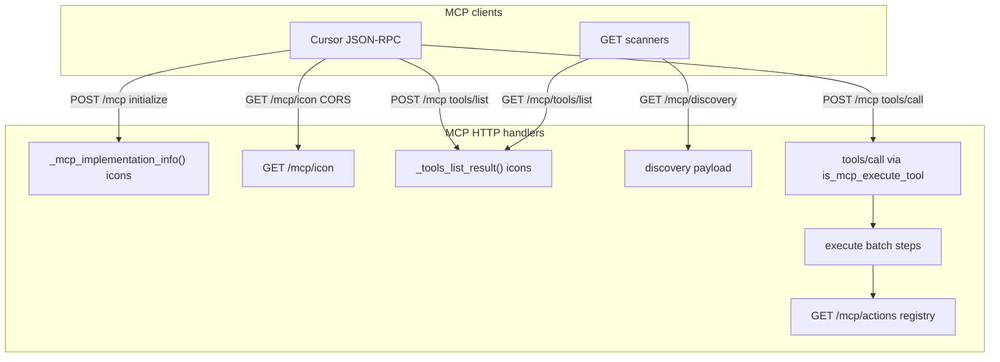

# MCP dedupe 0.4.16 — call & data flow

**Genes:** `core.mcp.tools.gen1`, `repo.plugins.cursor.gen3`, `foundation.elegant_minimalism.gen1`  
**ADR:** [MCP_TOOL_NAMING_CONTRACT.md](https://github.com/agentstacktech/agentstack/blob/main/docs/adr/MCP_TOOL_NAMING_CONTRACT.md)

## North star

| Surface | Count | Canonical name |
|---------|-------|----------------|
| Cursor MCP servers | 1–2 | Plugin Connect (`plugin-agentstack-*`) + optional Device Code `user-agentstack` |
| JSON-RPC `tools/list` | 1 | `agentstack.execute` |
| `tools/call` entry names | 2 accepted | `agentstack.execute` + `agentstack_execute` (Postel) |
| Action catalog | N | `GET /mcp/actions` (not tools/list) |

---

## Registration plane (Controller)

```mermaid
sequenceDiagram
  participant User
  participant DC as device-code.mjs
  participant MC as mcpConfig.mjs
  participant Disk as ~/.cursor/mcp.json
  participant Cursor

  User->>DC: /agentstack-authorize
  DC->>MC: applyAgentstackMcpBearer(cfg, token)
  MC->>Disk: lean streamable-http + Bearer
  Note over Disk: lean user mcp.json; plugin mcp.json is URL-only
  Cursor->>Disk: read mcpServers.agentstack
  Note over Cursor: sessionStart --from-hook → normalize + auto Device Code if gate needs login
```

**SoT modules:**

| Module | Role |
|--------|------|
| `lib/plugin-kernel/mcpConfig.mjs` | Lean shape, Bearer apply, strip `tools`/`baseUrl` |
| `lib/plugin-kernel/mcpSurfaceProbe.mjs` | Shared `tools/list` + alias contract probes |
| `hooks/scripts/device-code.mjs` | OAuth → write mcp.json + cache clear + snapshot |
| `hooks/scripts/session-start.mjs` | Normalize lean + snapshot + token rotation + auto Device Code (`--from-hook`) |

**Forbidden:** empty `${AGENTSTACK_ACCESS_TOKEN}` / `Authorization` in **plugin** `mcp.json` (G-A162). **Required (0.4.17):** `plugin.json` `mcpServers: "./mcp.json"` (string path) + URL-only plugin MCP. Device Code still writes `~/.cursor/mcp.json`. Native `mcp_auth` is not invoked from the agent — user clicks **Connect** (G-A174).

---

## Runtime plane (Model — core)



**Icons SoT:** Core `GET /mcp/icon` (SEP-973). Cursor **plugin chip** uses `plugin.json` `logo` → `assets/logo.png`, but only from `~/.cursor/plugins/cache` after `refresh-cursor-runtime.mjs --fix`. `user-agentstack` often ignores SEP-973 on the chat chip.

**Single SoT for tool row:** `_tools_list_result()` — used by:

- JSON-RPC `tools/list` (POST `/mcp`)
- `GET /mcp/tools`, `GET/POST /mcp/tools/list`

`GET /mcp/discovery` builds a parallel execute schema (no icons) plus `api_key_context`; do not treat it as the Cursor chip path.

**Constants:** `MCP_EXECUTE_TOOL_CANONICAL`, `is_mcp_execute_tool()` — alias only at **call** boundary.

---

## Data artifacts

| Path | Writer | Consumer | Shape |
|------|--------|----------|-------|
| `~/.cursor/mcp.json` | Device Code, session-start | Cursor MCP transport | Lean `mcpServers.agentstack` |
| `~/.cursor/agentstack-capabilities.json` | device-code, session-start, capability-refresh | pre-mcp-cap-check, diagnose | Flat `actions[]` |
| `~/.cursor/agentstack-refresh` | device-code | session-start | Refresh token |
| `~/.cursor/agentstack-device.lock` | device-code | session-start, diagnose | pid + Activate URL |
| `~/.cursor/agentstack-project` | /agentstack-login | device-code, session-start | Tenant id, not `1` |
| `GET /mcp/actions` | core registry | snapshot seed, matrix UI | `{ domains, total_actions }` |
| `POST /mcp` tools/list | `_tools_list_result()` | Cursor tool panel + chips | 1 tool + `actions_url` + `icons` |
| `POST /mcp` initialize | `_mcp_implementation_info()` | Cursor MCP handshake | `serverInfo.icons` (`/mcp/icon`) |
| `GET /mcp/icon` | `mcp_brand_icon_png_bytes()` | Cursor `fetch` (no credentials) | 64×64 PNG, CORS `*` |

---

## Verification commands

```bash
# Plugin plane + offline gates
node provided_plugins/cursor-plugin/scripts/diagnose-local.mjs

# API contract (prod or AGENTSTACK_BASE_URL)
node provided_plugins/cursor-plugin/scripts/verify-mcp-surface-e2e.mjs

# Full plugin audit
node provided_plugins/scripts/audit-cursor-plugin.mjs
```

---

## Anti-patterns (do not reintroduce)

1. Second tool name in `tools/list` (`agentstack_execute` alongside `agentstack.execute`)
2. `mcpServers` in `plugin.json`
3. Fat `mcp.json` with per-tool `tools{}` map (use `GET /mcp/actions` catalog)
5. Shipping plugin `mcp.json` (with or without a placeholder) to make MCP “appear in the plugin”
6. Cursor native MCP Connect / `mcp_auth` against `/mcp/.well-known/oauth-authorize` (ChatGPT verifier stub; not Device Code)
